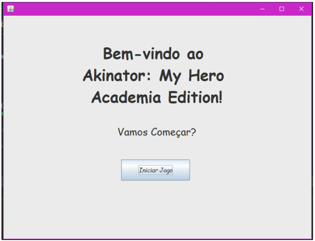
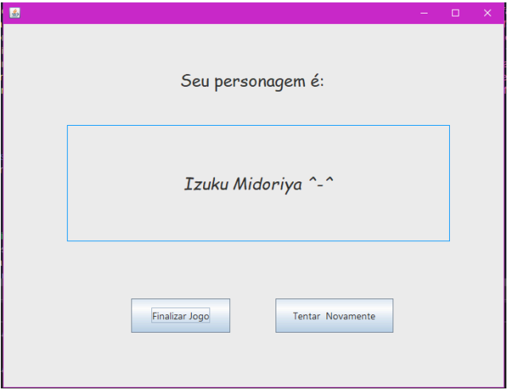

# Mini Akinator

## Descrição do Projeto

Mini Akinator é um jogo de adivinhação de personagens inspirado no famoso jogo Akinator. Neste jogo interativo, o computador tenta adivinhar um personagem que o jogador está pensando, fazendo uma série de perguntas de sim ou não. É uma demonstração divertida de como um algoritmo pode "adivinhar" informações com base em perguntas estratégicas.

## Funcionalidades Principais

1. **Interface Gráfica Intuitiva**: Desenvolvida com Swing, oferece uma experiência de usuário amigável e atraente.
2. **Base de Dados Diversificada**: Inclui personagens do anime "My Hero Academia - Alunos".
3. **Sistema de Perguntas Inteligente**: Utiliza um algoritmo baseado em um filtro para filtrar os personagens de acordo com as perguntas.
4. **Adivinhação Eficiente**: Capaz de adivinhar personagens em 23 perguntas.

## Como o Jogo Funciona

1. **Início do Jogo**: O jogador pensa em um personagem da base de dados do jogo.
2. **Fase de Perguntas**: O jogo faz uma série de perguntas sobre as características do personagem.
3. **Respostas do Jogador**: Para cada pergunta, o jogador responde "Sim" ou "Não".
4. **Processamento de Dados**: Com base nas respostas, o jogo filtra dinamicamente a lista de personagens possíveis.
5. **Adivinhação**: O processo continua até que o jogo adivinhe o personagem ou esgote o número máximo de perguntas (15).
6. **Resultado**: O jogo apresenta sua adivinhação ou, se não conseguir, mostra os personagens mais prováveis.

## Requisitos do Sistema

- Java JDK 11 ou superior
- IDE compatível com Java (o projeto foi desenvolvido e testado no Apache NetBeans IDE 22)

## Como Executar o Jogo

1. **No Apache NetBeans**:

   - Abra o arquivo `Main.java`.
   - Execute o codigo com o botão "RUN".

## Estrutura do Projeto

- `src/frames/`: Contém `Main_Interface` para a interface principal, `Game_Interface` para a interface do jogo, `Final_Interface` para a interface final.
- `src/akinator/myheroacademia/Students_Characters`: Classe com atributos definidos dos personagens.
- `src/akinator/myheroacademia/Main.java`: Ponto de entrada do programa.

## Como Jogar

1. Inicie o jogo e pense em um personagem da base de dados.
2. Responda às perguntas clicando nos botões "Sim" ou "Não".
3. Continue respondendo até que o jogo adivinhe.
4. No final, veja se o jogo adivinhou corretamente seu personagem!
5. Se no final não foi encontrado nenhum personagem, você pode escolher "Jogar Novamente" ou "Finalizar o jogo" clicando nos botões respectivamente.

## CASO A EXPLICAÇÃO ACIMA NÃO TENHA SIDO SUFICIENTE, SEGUE ABAIXO UM PASSO A PASSO MAIS DETALHADO:

- BAIXAR PDF -> [PROJETO MINI - AKINATOR](./Documentação%20Mini-Akinator.pdf)

## Contato e Suporte

- Desenvolvedora: Beatriz Alves
- [Email](balves.souza14@gmail.com)
- [GitHub](https://github.com/BiaAS2)

## Docente do Projeto

- Glender Brás
- [Linkedin](https://www.linkedin.com/in/glenderbras/)

### Imagens do projeto

